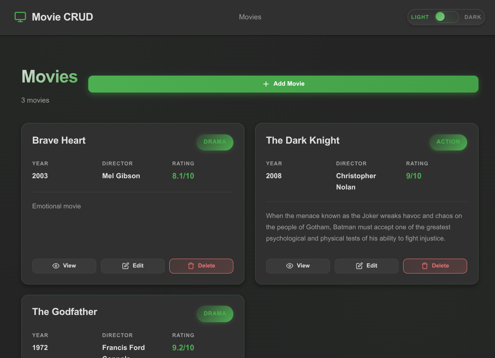

# Movie CRUD Application

[](https://github.com/CristiamSanchez/CRUDMovie_CSharp-Angular/actions/workflows/ci.yml)
[](https://cristiamsanchez.github.io/CRUDMovie_CSharp-Angular/)

A simple full-stack Movie CRUD application built with **ASP.NET Core 10** (Web API), **Angular 22** (frontend), and **PostgreSQL 16** (database).

This project was developed with the assistance of **OpenCode AI** as a development assistant, using:
- **C# / ASP.NET Core** for the backend REST API
- **Angular** (standalone components, reactive forms) for the frontend
- **PostgreSQL** for data persistence
- **Docker** for containerized database

---

## Technology Stack

| Layer | Technology |
|-------|------------|
| Backend | C# 13, ASP.NET Core 10, Entity Framework Core 10 |
| Frontend | TypeScript, Angular 22 (standalone components), RxJS |
| Database | PostgreSQL 16 (Docker) |
| API Documentation | Swagger / OpenAPI (Swashbuckle) |
| Containerization | Docker Compose (PostgreSQL only) |
| CI / CD | GitHub Actions (CI validation + GitHub Pages deployment) |

---

## Screenshots



*The movie list view with card-based layout, genre badges, and modal-based create/edit forms.*

---

## Architecture Overview

```
┌─────────────────┐     HTTP/JSON      ┌─────────────────┐     EF Core      ┌──────────────┐
│   Angular       │ ──────────────────► │  ASP.NET Core   │ ───────────────► │  PostgreSQL  │
│   (port 4200)   │ ◄────────────────── │  Web API        │ ◄─────────────── │  (port 5435) │
└─────────────────┘   REST + CORS       └─────────────────┘   Npgsql         └──────────────┘
```

- **Angular** runs on `http://localhost:4200`
- **ASP.NET Core API** runs on `http://localhost:5148`
- **PostgreSQL** runs in Docker on `localhost:5435` (mapped from container port 5432)
- **CORS** is configured to allow requests from `http://localhost:4200`

---

## Folder Structure

```
Movies/
├── .gitignore                 # Git ignore rules
├── .env                       # Local environment variables (NOT committed)
├── .env.example               # Template for environment variables
├── .github/
│   └── workflows/
│       ├── ci.yml             # CI: backend + frontend validation (push/PR to main)
│       └── deploy-pages.yml   # Deploys the Angular build to GitHub Pages
├── docker-compose.yml         # PostgreSQL container definition
├── Movies.slnx                # .NET Solution
├── README.md                  # This file
├── docs/
│   └── screenshots/           # Project screenshots
└── src/
    ├── Movies.Api/            # ASP.NET Core Web API
    │   ├── Controllers/       # API Controllers
    │   ├── Data/              # EF Core DbContext
    │   ├── DTOs/              # Data Transfer Objects
    │   ├── Migrations/        # EF Core Migrations
    │   ├── Models/            # Entity models
    │   ├── Services/          # Business logic services
    │   ├── Program.cs         # Application entry point
    │   ├── appsettings.json
    │   └── appsettings.Development.json
    └── Movies.Web/            # Angular Application
        ├── src/
        │   ├── app/
        │   │   ├── core/
        │   │   │   ├── models/        # TypeScript interfaces
        │   │   │   └── services/      # HTTP services
        │   │   ├── features/
        │   │   │   ├── movie-list/    # Movie list component
        │   │   │   ├── movie-detail/  # Movie detail component
        │   │   │   └── movie-form/    # Create/Edit form component (modal)
        │   │   ├── shared/
        │   │   │   └── components/
        │   │   │       └── modal/     # Reusable modal component
        │   │   ├── app.config.ts      # App configuration
        │   │   ├── app.routes.ts      # Routing configuration
        │   │   ├── app.ts             # Root component
        │   │   ├── app.html           # Root template
        │   │   └── app.css            # Global styles (dark/light theme)
        │   ├── environments/
        │   │   ├── environment.ts            # Local build (localhost API)
        │   │   ├── environment.development.ts
        │   │   └── environment.pages.ts      # GitHub Pages build (no backend)
        │   ├── main.ts
        │   ├── index.html
        │   └── styles.css
        ├── angular.json
        ├── package.json
        └── tsconfig.json
```

---

## Prerequisites

- **.NET 10 SDK** (or compatible version)
- **Node.js 20+** and **npm 10+**
- **Docker** and **Docker Compose**
- **Angular CLI** (optional, can use `npx @angular/cli`)

---

## PostgreSQL Docker Setup

1. Copy the example environment file (optional, uses defaults if not present):
   ```bash
   cp .env.example .env
   ```

2. Start PostgreSQL:
   ```bash
   docker compose up -d
   ```

3. Verify it's healthy:
   ```bash
   docker compose ps
   # Should show: movies-db  ...  Up ... (healthy)
   ```

4. Connection details (from `.env`):
   - Host: `localhost`
   - Port: `5435` (mapped from container port 5432)
   - Database: `movies`
   - Username: `movies_user`
   - Password: `movies_pass`

5. Stop PostgreSQL:
   ```bash
   docker compose down
   ```

6. Stop and remove volume (⚠️ deletes data):
   ```bash
   docker compose down -v
   ```

---

## Backend Setup (ASP.NET Core)

1. Navigate to the API project:
   ```bash
   cd src/Movies.Api
   ```

2. Restore dependencies:
   ```bash
   dotnet restore
   ```

3. Run EF Core migrations (creates/updates database schema):
   ```bash
   dotnet ef database update
   ```

   To create a new migration after model changes:
   ```bash
   dotnet ef migrations add <MigrationName>
   dotnet ef database update
   ```

4. Run the API:
   ```bash
   dotnet run
   ```

   The API will start on:
   - **HTTP**: `http://localhost:5148`
   - **HTTPS**: `https://localhost:7129` (if configured)

---

## Frontend Setup (Angular)

1. Navigate to the Angular project:
   ```bash
   cd src/Movies.Web
   ```

2. Install dependencies:
   ```bash
   npm install
   ```

3. Run the development server:
   ```bash
   npx ng serve
   ```

   The app will be available at `http://localhost:4200`

4. Build for production:
   ```bash
   npx ng build --configuration production
   ```

---

## Running the Complete Application

### Terminal 1: PostgreSQL
```bash
docker compose up -d
```

### Terminal 2: Backend API
```bash
cd src/Movies.Api
dotnet run
```
- API: `http://localhost:5148`
- Swagger UI: `http://localhost:5148/swagger`

### Terminal 3: Frontend
```bash
cd src/Movies.Web
npx ng serve
```
- Angular: `http://localhost:4200`

---

## Key URLs

| Service | URL |
|---------|-----|
| Angular Frontend | http://localhost:4200 |
| ASP.NET Core API | http://localhost:5148/api/movies |
| Swagger / OpenAPI | http://localhost:5148/swagger |
| PostgreSQL | localhost:5435 |

---

## Useful Development Commands

### Backend
```bash
# Build solution
dotnet build

# Run API
cd src/Movies.Api && dotnet run

# Add EF Core migration
dotnet ef migrations add <Name> -p src/Movies.Api

# Apply migrations
dotnet ef database update -p src/Movies.Api

# Remove last migration
dotnet ef migrations remove -p src/Movies.Api

# List migrations
dotnet ef migrations list -p src/Movies.Api
```

### Frontend
```bash
# Install dependencies
cd src/Movies.Web && npm install

# Dev server
npx ng serve

# Production build
npx ng build --configuration production

# Type-check (the root tsconfig.json has no inputs, so target the projects explicitly)
npx tsc --noEmit -p tsconfig.app.json
npx tsc --noEmit -p tsconfig.spec.json

# Run unit tests
npx ng test
```

### Docker
```bash
# Start PostgreSQL
docker compose up -d

# View logs
docker compose logs -f postgres

# Stop
docker compose down

# Stop and remove data volume
docker compose down -v

# Restart PostgreSQL
docker compose restart postgres
```

---

## Stopping the Application

```bash
# Stop Angular (Ctrl+C in terminal)

# Stop API (Ctrl+C in terminal)

# Stop PostgreSQL
docker compose down
```

---

## Troubleshooting

### Port Already in Use

**PostgreSQL (5435)**:
```bash
# Check what's using the port
lsof -i :5435
# Or on Linux:
ss -tlnp | grep 5435

# Change POSTGRES_PORT in .env to an available port (e.g., 5436)
# Then update docker-compose.yml accordingly
```

**API (5148)**:
```bash
lsof -i :5148
# Kill process or change port in src/Movies.Api/Properties/launchSettings.json
```

**Angular (4200)**:
```bash
lsof -i :4200
# Or use: npx ng serve --port 4201
```

### PostgreSQL Connection Issues

1. Verify container is running and healthy:
   ```bash
   docker compose ps
   docker compose logs postgres
   ```

2. Check connection string in `src/Movies.Api/appsettings.Development.json`:
   ```json
   "ConnectionStrings": {
     "DefaultConnection": "Host=localhost;Port=5435;Database=movies;Username=movies_user;Password=movies_pass"
   }
   ```

3. Test connection directly:
   ```bash
   docker exec -it movies-db psql -U movies_user -d movies
   ```

### CORS Errors

If you see CORS errors in browser console:

1. Verify API CORS policy in `src/Movies.Api/Program.cs`:
   ```csharp
   builder.Services.AddCors(options =>
   {
       options.AddPolicy("AngularDev", policy =>
       {
           policy.WithOrigins("http://localhost:4200")
                 .AllowAnyHeader()
                 .AllowAnyMethod();
       });
   });
   ```

2. Ensure Angular is running on `http://localhost:4200` (not 127.0.0.1 or other port)

3. Check browser console for exact error - preflight (OPTIONS) must return 204

### EF Core Migration Issues

```bash
# If migration fails, ensure PostgreSQL is running
docker compose up -d

# Reset database completely (⚠️ deletes all data)
docker compose down -v
docker compose up -d
dotnet ef database update -p src/Movies.Api
```

### Angular Build Errors

```bash
# Clear cache and reinstall
cd src/Movies.Web
rm -rf node_modules package-lock.json
npm install
npx ng build
```

---

## API Endpoints

| Method | Endpoint | Description |
|--------|----------|-------------|
| GET | `/api/movies` | List all movies |
| GET | `/api/movies/{id}` | Get movie by ID |
| POST | `/api/movies` | Create a movie |
| PUT | `/api/movies/{id}` | Update a movie |
| DELETE | `/api/movies/{id}` | Delete a movie |

### Movie JSON Format
```json
{
  "id": 1,
  "title": "The Shawshank Redemption",
  "description": "Two imprisoned men bond...",
  "genre": "Drama",
  "releaseYear": 1994,
  "director": "Frank Darabont",
  "rating": 9.3
}
```

### Valid Genres
`Action`, `Comedy`, `Drama`, `Horror`, `SciFi`, `Documentary`, `Animation`, `Thriller`, `Romance`, `Other`

### Validation Rules
- **Title**: Required, max 200 chars
- **Description**: Optional, max 2000 chars
- **Genre**: Required, must be one of the valid genres
- **Release Year**: Required, between 1888 and 2100
- **Director**: Required, max 100 chars
- **Rating**: Required, between 0.0 and 10.0 (one decimal)

---

## Development Notes

- **No external UI libraries** - Plain CSS and Angular Reactive Forms
- **No global state management** - Services provided in root injector
- **No global error interceptor** - Component-level inline error handling
- **Lazy-loaded routes** - Each feature loads on demand
- **Environment config** - Local API URL in `src/Movies.Web/src/environments/environment.ts`; the GitHub Pages build uses `environment.pages.ts`, selected by the `production-pages` Angular build configuration
- **PostgreSQL only in Docker** - API and Angular run locally for easier debugging
- **Modal-based forms** - Create/Edit use accessible modal dialogs with focus trapping
- **Dark/Light theme** - Automatic theme detection via CSS `prefers-color-scheme`

---

## Continuous Integration (GitHub Actions)

Workflow: [`.github/workflows/ci.yml`](.github/workflows/ci.yml) — runs on every **push to `main`** and every **pull request to `main`**.

**Backend job** (ubuntu-latest, .NET 10 SDK):
1. `dotnet restore Movies.slnx`
2. `dotnet build Movies.slnx --no-restore`
3. **Integration smoke test** against a **PostgreSQL 16 service container** (healthchecked with `pg_isready`): the API is started with a disposable test connection string — startup applies EF Core migrations — then the workflow verifies the REST endpoints end to end: `GET` returns an array (200), a valid `POST` creates a movie (201), an invalid `POST` is rejected (400), and `DELETE` removes it (204).

**Frontend job** (ubuntu-latest, Node.js 24):
1. `npm ci`
2. Type-check: `npx tsc --noEmit -p tsconfig.app.json` and `npx tsc --noEmit -p tsconfig.spec.json`
3. Unit tests: `npx ng test`
4. Production build: `npx ng build --configuration production`

**Current test coverage (honestly reported — no fabricated results):**
- The **backend has no unit/integration test projects**, so CI verifies restore, build, and a real database-backed integration smoke test rather than unit tests.
- The **frontend** has one unit-test file (`src/app/app.spec.ts`, 2 tests) covering the app shell (component creation, header rendering).

**Security:**
- No secrets, API keys, or production credentials in workflows. The PostgreSQL service container uses disposable CI-only values (`movies_ci` / `movies_ci_password`) passed as workflow environment variables.
- The repository `.env` file is never used by CI (it is gitignored).
- The workflow runs with read-only permissions (`permissions: contents: read`).

---

## Deployment (GitHub Pages)

Workflow: [`.github/workflows/deploy-pages.yml`](.github/workflows/deploy-pages.yml) — runs on **push to `main`**, or manually via *Actions → Deploy to GitHub Pages → Run workflow*.

**Live site:** https://cristiamsanchez.github.io/CRUDMovie_CSharp-Angular/

### How it works
1. Builds the frontend with the `production-pages` Angular configuration, which sets **`baseHref: /CRUDMovie_CSharp-Angular/`** (base href, not `deploy-url`) and swaps `environment.ts` → `environment.pages.ts`.
2. Copies `index.html` to `404.html` so client-side routes survive refreshes and deep links.
3. Publishes the static build with the official GitHub Pages actions: `actions/configure-pages` → `actions/upload-pages-artifact` → `actions/deploy-pages`.

### What is hosted where

| Component | Local | GitHub Pages |
|-----------|-------|--------------|
| Angular frontend | ✅ `http://localhost:4200` | ✅ static production build |
| ASP.NET Core API | ✅ `http://localhost:5148` | ❌ not possible |
| PostgreSQL 16 | ✅ Docker, `localhost:5435` | ❌ not possible |

**PostgreSQL runs locally in Docker** (`docker compose up -d`), and **GitHub Pages hosts only the Angular static frontend**. Pages cannot run ASP.NET Core or PostgreSQL.

### Demo build (no public backend yet)

No public API exists for this project yet, so the Pages build uses `src/Movies.Web/src/environments/environment.pages.ts` with an **empty `apiUrl`**: the deployed site never points at localhost and no backend URL is invented. The result is a **UI/demo build** — the full interface (layout, theme switch, routing) works, but movie data requests fail and the app shows its inline *"Failed to load movies"* error.

**Full CRUD online requires a separately hosted ASP.NET Core backend and PostgreSQL database.** To enable it:
1. Host the API + PostgreSQL externally (e.g. Azure, Railway, Render, a VPS).
2. Set the public API URL in `environment.pages.ts` (e.g. `apiUrl: 'https://api.example.com/api'`).
3. Allow the Pages origin in the API CORS policy (`Program.cs`, currently allows only `http://localhost:4200`).
4. Push to `main` — the workflow rebuilds and redeploys.

### Required manual GitHub settings (one time)

1. **Settings → Pages → Build and deployment → Source**: select **GitHub Actions**.
2. **Settings → Actions → General**: GitHub Actions enabled (default for public repositories).
3. Push the workflows to `main` and watch the run in the **Actions** tab; the deploy job exposes the site URL through its `github-pages` environment.

---

## License

This is a learning project. Use freely for educational purposes.